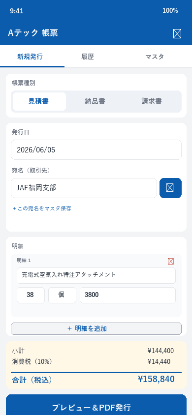
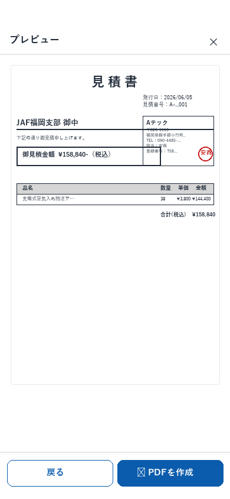

# Aテック 帳票作成アプリ ご利用マニュアル（Android版）

スマホで **見積書 / 納品書 / 請求書** を作って、メールやLINEですぐ送れるアプリです。

---

## 1. はじめに使う前の準備（最初の1回だけ）

### ステップ① アプリを開く

LINE等で送られてきたURL（`https://fukuokacolor-web.github.io/atech-quote/`）を **Google Chrome** で開きます。

> ⚠ **必ず Chrome で開いてください**
> LINEから直接タップするとLINE内ブラウザで開いてしまい、ホーム画面に追加できません。
> その場合は、画面右上「⋮」メニュー →「ブラウザで開く」または「Chromeで開く」を選択してください。

### ステップ② ホーム画面に追加する

**方法A：自動表示されるバナー（おすすめ）**

ページ下部または上部に「**ホーム画面に追加**」「**インストール**」というバナーが自動表示されます。
タップして「インストール」を選択するだけ。

**方法B：メニューから手動で追加**

Chromeの **右上「⋮」メニュー** をタップ → 以下のいずれかを選択：
- 「**アプリをインストール**」
- 「**ホーム画面に追加**」
- 「**Aテック 帳票作成 をインストール**」

確認ダイアログで「インストール」または「追加」をタップ。

### ステップ③ ホーム画面のアイコンから起動

ホーム画面に **「Aテック帳票」アイコン**（青地に「A帳」）が追加されているのでタップして起動します。
2回目以降は **このアイコンから起動するだけ** でOKです。

> 💡 一度インストールすれば、Chromeのタブを開かなくても、独立したアプリのように使えます。

### ステップ④ 設定を確認（初回のみ推奨）

画面右上の **⚙ アイコン** をタップして、以下が正しく入っているか確認してください：

| 項目 | 既に入っている値 |
|---|---|
| 屋号 | Aテック |
| 郵便番号 | 820-1113 |
| 住所 | 福岡県鞍手郡小竹町勝野4053-1 |
| 電話番号 | 090-4485-0184 |
| 担当者名 | 安西 |
| インボイス登録番号 | T5810248089393 |
| 振込先 | 福岡銀行 黒崎支店 普通預金 口座番号 2879217 |
| 口座名義 | 安西 賢一郎（アンザイ ケンイチロウ） |

変更があれば書き換えて「保存」を押してください。

---

## 2. 見積書を作る（基本の使い方）

### ステップ① 「新規発行」タブで帳票種別を選ぶ

画面上部の **「見積書 / 納品書 / 請求書」** ボタンから選びます。

### ステップ② 宛名を入力

「宛名（取引先）」欄に取引先名を入力。
過去に登録した取引先は **📋ボタン** から選べます。
新しい取引先なら「＋この宛名をマスタ保存」で次回から呼び出せます。

### ステップ③ 車両情報を入力（JAF案件のみ・任意）

JAF福岡支部宛の車両加工などでは、「車両：筑豊基地 パジェロ」「車両ナンバー：筑豊300 に 6625」のように記入。
不要なら空欄でOK。

### ステップ④ 明細を入力

「＋ 明細を追加」をタップして以下を入力：

| 項目 | 例 |
|---|---|
| 品名 | 充電式空気入れ特注アタッチメント |
| 数量 | 38 |
| 単位 | 個 |
| 単価（税抜） | 3800 |

複数行追加可能。間違えたら 🗑 で削除。

> 💡 **品名マスタを使うと便利！**
> よく使う品名（例：「背面タイヤキャリア加工」）を「マスタ」タブで登録しておくと、「＋明細を追加」時に番号入力だけで呼び出せます。

### ステップ⑤ 合計を確認

入力すると自動で **小計・消費税・合計（税込）** が計算されます。

### ステップ⑥ 「プレビュー＆PDF発行」をタップ

仕上がりを確認できます。問題なければ次のステップへ。

### ステップ⑦ 「📄 PDFを作成」をタップ

数秒待つと **共有メニュー** が表示されます。

---

## 3. PDFを送る・印刷する

Android の共有メニューから用途に応じて選びます：

| やりたいこと | タップするもの |
|---|---|
| 取引先にメール送付 | **Gmail** または **メール** |
| LINEで送る | **LINE** |
| スマホに保存 | **ファイル**（内部ストレージ／Download） |
| Google Driveに保存 | **ドライブに保存** |
| 印刷する | **印刷** （AndroidのCloud Print／Mopria対応プリンタ） |
| パソコンに送る | **Bluetooth** または **ニアバイシェア** |

> ✅ PDFはアプリに **自動で履歴保存** されています。後から見直し・再ダウンロード可能。

> 💡 もし共有メニューが出ない場合は、PDFが **Downloadフォルダ** に自動保存されます。
> 「ファイル」アプリ → Download から探してください。

---

## 4. 過去の帳票を再利用する

「履歴」タブを開くと過去発行した帳票が新しい順に並んでいます。

- 取引先名や番号で **🔍 検索** できます
- 「読込」ボタンで明細を **新規発行画面に呼び戻す** ことができます
  → 同じ取引先への請求書を作るときなど、丸ごとコピーして金額だけ変える、が簡単にできます

---

## 5. 納品書・請求書も同じ手順で

- 「納品書」を選ぶと、納品内容の文言に切り替わります
- 「請求書」を選ぶと、振込先案内が自動で備考欄に入ります

> 💡 **典型的な流れ**
> 1. 見積書を発行
> 2. 仕事完了後、履歴から見積を「読込」 → 種別を「納品書」に切替 → PDF発行
> 3. 月末に同じく「読込」→「請求書」に切替 → PDF発行
>
> **見積→納品→請求が30秒で完了**します。

---

## 6. データのバックアップ（重要）

データは **スマホ本体に保存** されています。機種変更や故障の前に **必ずバックアップ** してください。

### バックアップ方法

1. ⚙ 設定 を開く
2. 「📤 全データをバックアップ書き出し」をタップ
3. 共有メニューから「**ドライブに保存**」→ **Google Drive** に保存（推奨）
   または「**ファイルに保存**」で内部ストレージのDownloadフォルダに保存

### 復元方法（機種変後など）

1. 新しいスマホで本アプリを開き、⚙ 設定 を開く
2. 「📥 バックアップを読み込む」をタップ
3. 保存したJSONファイルを選択（Google Driveまたはローカル）
4. 確認ダイアログで「OK」

> 📅 **毎月末** にバックアップする習慣をつけることをおすすめします。
> Google Driveに保存しておけばスマホが壊れても安心です。

---

## 7. よくある質問

**Q. インターネット繋がってなくても使える？**
A. はい。一度ホーム画面に追加してあれば、機内モードでも見積書を作成・PDF出力できます。メール送信時のみ通信が必要です。

**Q. 印影（電子印）を変えたい**
A. 安西様の印として作成済みです。別の方の印影に変えたい場合は管理者にご連絡ください。

**Q. データが消えたら？**
A. スマホ本体（Chromeのストレージ）に保存されているため、Chromeのデータ削除や機種変更で消える可能性があります。**定期バックアップ**をお願いします。

**Q. 複数の機種で同じデータを使いたい**
A. バックアップ機能でJSONファイルをGoogle Driveに保存して、別端末でインポートすれば可能です（リアルタイム同期ではありません）。

**Q. 紙に印刷したい**
A. PDF作成後の共有メニューから「印刷」を選択。Mopria/Cloud Print対応のプリンタが必要です。コンビニ印刷はPDFをファイル保存してから「ネットワークプリント」「セブン-イレブンマルチコピー」等のアプリをご利用ください。

**Q. 計算が違う気がする**
A. 消費税は10%・端数切捨てで計算しています。複数明細がある場合は **小計に対して** 一括で消費税計算します（明細ごとの税計算ではありません）。

**Q. Chromeのアップデートで使えなくなった**
A. 「⋮」メニュー → 設定 → サイトの設定 → ストレージ で本アプリのデータが残っているか確認してください。ただし、ホーム画面追加した状態であればChromeアップデートの影響は受けません。

---

## 8. 困ったときは

ご不明点・追加機能のご要望は管理者までご連絡ください。

- **動作不調** → アプリを再起動／ホーム画面アイコンから再度開く
- **画面表示が崩れた** → Chromeで「⋮」→「再読込」
- **完全リセット** → ⚙ 設定 →「⚠ 全データを削除」（バックアップを取ってから！）

---

**バージョン**：1.0
**対応OS**：Android 8 以上 / Google Chrome 最新版
**作成**：2026年6月
